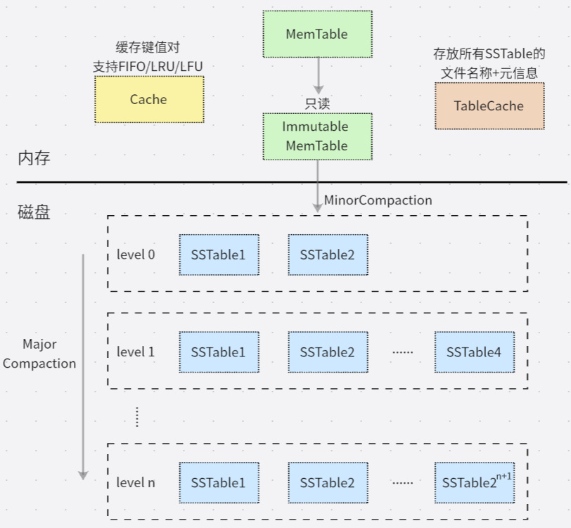
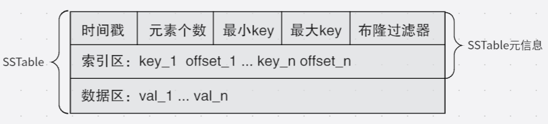

# LSM_KVStore

## 项目介绍
基于LSM的轻量级KV数据存储引擎，提供get、put、del接口

- 数据在内存中采用跳表的形式存储，并且在内存中保存了两个跳表，一个是用于写入数据的 MemTable， 另一个是只读的 Immutable MemTable。当 MemTable 超过设定的容量阈值后转化为 Immutable MemTable，创建新线程写入磁盘成为 SSTable，保存在 level 0
- SSTable 分层存储，第 i 层的 SSTable 数量上限是 2^i + 1，只有 level 0 的 SSTable 的键值范围可以有重叠。当 level 0 的文件数量超过上限就要执行多路归并，合并到下一层
- 通过线程池实现异步调用，支持多线程读和单线程写
- 支持基于FIFO、LRU、LFU的缓存策略

LSM Tree:


SSTable文件存储格式:


## 项目结构
- `include`：头文件
- `src`：源文件
- `test`：测试代码
- `data`：SSTable的存放目录
- `bin`：生成的可执行文件的存放目录
- `html`：doxygen生成的项目说明文件（annotated.html）
- `pic`：README.md用到的图像数据

## 项目测试
进入项目所在目录：

```shell
mkdir build
cd build
cmake ..
make
./bin/test_kvstore ./data 10000  # ./data是存放SST文件的目录，10000是测试数据量
```

## KVStore类核心接口逻辑
### put 接口
`void KVStore::Put(uint64_t key, const std::string &val, bool to_cache)`
1. 查询 key 是否在 MemTable 中
    1. 如果在 MemTable 中，更新该 key 对应的 value
    2. 如果不在 MemTable 中：
        1. 如果加上新插入的键值对后 MemTable 大小没有超过阈值，直接将键值对插入 MemTable
        2. 如果加上新插入的键值对后 MemTable 大小超过阈值，将 MemTable 转换为 Immutable MemTable，并重新创建一个MemTable 插入键值对。创建子线程实现 MinorCompaction
2. 如果缓存标志为true，则缓存该键值对

### get 接口
`std::string KVStore::Get(uint64_t key)`
1. 查询缓存中是否有该 key，如果有则直接返回
2. 查询 MemTable 中是否有该 key，如果查询结果 value 非空：
    1. 如果 value 是已删除标志，返回空字符串
    2. 否则返回 value
3. 查询 Immutable MemTable 中是否有该 key，如果查询结果 value 非空：
    1. 如果 value 是已删除标志，返回空字符串
    2. 否则返回 value

    若在 MinorCompaction 则等待其结束在进入下一步
4. 查询 SSTable，按照从 level 0 到 level n 的顺序，找到则返回。对于每个 SSTable：
    1. 判断 key 是否在该 SSTable 的 min_key ~ max_key 之间，如果不在则进入下一个 SSTable 查询
    2. 布隆过滤器判断该 key 是否存在，如果不存在则进入下一个 SSTable 查询
    3.  如果索引区的 SSTable 中不存在该 key，则返回空字符串，否则根据 key 对应的偏移量读取 value

### del 接口
`bool KVStore::Del(uint64_t key, bool to_cache)`
不立刻删除该键值对，而是调用 Put 接口给该 key 打上删除标记，实际的删除在合并文件时进行

### 补充（合并SSTable）
#### MinorCompaction
`void KVStore::MinorCompaction()`
1. 将 Immutable MemTable 保存到level 0，生成新的 SSTable
2. 添加新生成的 SSTable 对应的元信息
3. 检查 level 0 的 SSTable 数量是否超过设定值，如果超过则需要合并到下一层

#### MajorCompaction
`void KVStore::MajorCompaction(int level)`
1. 判断 level - 1 的 SSTable 的数量是否小于等于设定值，若是则不需要合并，直接返回
2. 遍历 level - 1 中将要被合并的 SSTable 并读入内存，获取时间戳和最小最大 key
3. 寻找 level 与 level - 1 的 key 有交集的文件，并读入内存
4. 对读入内存的数据进行多路归并，并写入当前层
5. 判断下一层是否需要进行 MajorCompaction

## 项目说明文件
生成项目的说明文件：

```shell
# 安装 Graphviz
sudo apt install graphviz
# 安装 Doxygen
sudo apt install doxygen
# 进入项目目录，生成配置文件
doxygen -g Doxygen.config
# 修改配置文件
vi Doxygen.config
# 需要修改的部分：
    # EXTRACT_ALL            = YES
    # HAVE_DOT               = YES
    # UML_LOOK               = YES
    # RECURSIVE              = YES
# 生成项目的说明文件
doxygen Doxygen.config
```

点击 html 目录下的 `annotated.html`


## 参考
- LSM：
    - https://mp.weixin.qq.com/s/90sxtXvnb5ytDB0YX2tW9Q
    - https://github.com/leiyx/My_LSM_KVStore
- Google C++ style: https://google.github.io/styleguide/cppguide.html
- 自动生成C++ UML图：https://blog.csdn.net/Cross_Entropy/article/details/117265884
- 线程池：https://zhuanlan.zhihu.com/p/367309864
- C++并发编程：https://paul.pub/cpp-concurrency/